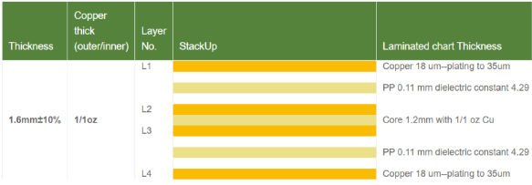
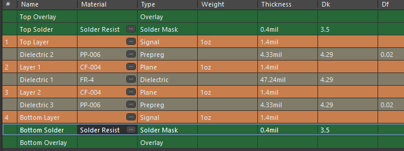
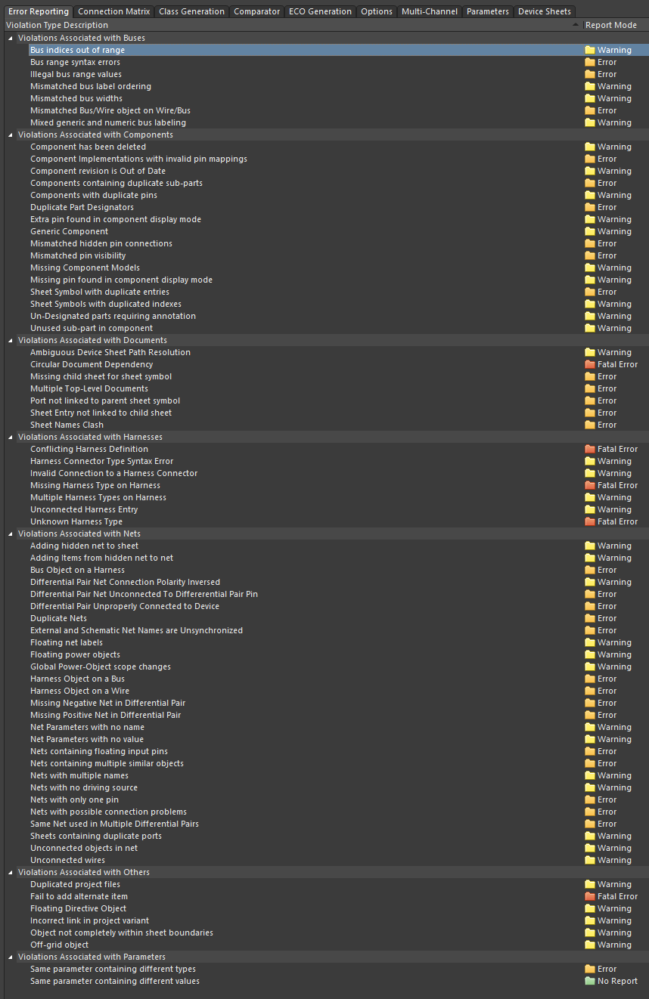

# Altium_Resources
A repository to keep Altium resources I come across and or create.

This purpose of this repository is primarily to provide a starting point in learning Altium Designer for PCB design

----------------------------------------
----------------------------------------
# Schematic tips
- WHEN CREATING THE PROJECT
  - Make sure to know if you want constraints manager
  - or if you want old design rules
- old design rules makes easier importing
  - caveat is that if you use one type of constraints management - you cant swap to the other mid project
    - You can get around this by creating a new project and adding the files as existing files to the new project

## Generally useful things
- To automatically have components named, use:
  - `tools` $\rightarrow$ `annotation` $\rightarrow$ `annotate schematics`
  - from here, you can choose the pattern of how names are assigned
    - once satisfied with the assignment settings, click `update changes list`
    - then click `accept changes (create ECO)`
- Placing `power nets`, when clicking on the type of port, press `tab` to rename the port currently being held onto
- When running ERC, look at the "panels" button in the bottom right to view messages 
  - this is where your ERC result is

## Project setup
- To create new schematic and PCB files, `Right-click` on the project and click, `add new to project...`
- To import existing libraries (eg: schematic symbols/footprints), `Right-click` on the project and click, `add existing to project...`

# Shortcuts
- Place net label
  - `p` $\rightarrow$ `n`
- Non-connect ports
  - `p` $\rightarrow$ `v` $\rightarrow$ `n`
- Draw a line
  - `p` $\rightarrow$ `d` $\rightarrow$ `l`
- Write text
  - `p` $\rightarrow$ `t`
- rotate element
  - `spacebar`
- flip along x or y axis
  - `x` or `y`

## Move on to PCB?
- If ready, run ERC - ensure no large errors (warnings might be ok)
- When ERC is done, go to: `Design`  $\rightarrow$ `Update PCB document <file.PcbDoc>`

----------------------------------------
----------------------------------------
# PCB tips

## PCBWay 4-layer board stackup
- 4layer stackup from the School of Electrical & Telecommunications Engineering UNSW

- Altium 4-layer stackup (PCBWay)

## Design rules
- Set this up first
- look at PCB fab design rules $\rightarrow$ import them into your DRC 
  - you should check your design rules even if you import the fab's rules
  - `only way to be sure is to check the rules yourself`
- Follow general good design practices
  - group subsystems
  - orient passives in the same direction where possible
  - try think of interconnects
  - may need to rethink pin mapping 
  - think of power connections and return paths
  - how wide do traces need to be? power? signal?

## Error reporting
- default settings looked alright to me?
  - Connection matrix could be fiddled with if DRC being too painful
- 

## Component classes
- Not entirely sure why yet, but this video: https://www.youtube.com/watch?v=YTGzncKU5RY mentions that `component classes` should be turned off, along with turning off `generate rooms`

